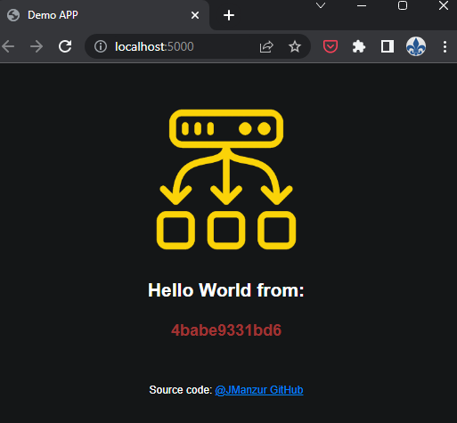
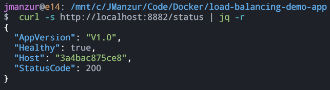

# Load Balancing Demo APP

Why do all demo apps have to be ugly? I don't want any blank page with off-center black text. Let's use something pretty!

This is a simple Flask APP that runs in a Docker container and you can use it to test load balancing. The useful part for testing load balancing is that this app returns the hostname of the container it is running on, so you can confirm that your load balancing setup is working.

This app also includes a status page to test healthcheck.

> #### :bulb: [Also available on Docker Hub!](https://hub.docker.com/r/jmanzur/demo-lb-app)


## Tested with: 

| Environment | Application | Version  |
| ----------------- |-----------|---------|
| WSL2 Ubuntu 20.04 | Docker | 20.10.17  |
| WSL2 Ubuntu 20.04 | Python | 3.9.5 |

## Run App.py Locally

Clone the project

```bash
git clone https://github.com/JManzur/load-balancing-demo-app.git
```

Go to the project directory

```bash
cd load-balancing-demo-app
```

If you wish to test the python app locally, install the requirements:

```bash
  pip3 install -r requirements.txt
```

Start the server

```bash
  python3 app.py
```

Access the web app:

http://127.0.0.1:5000/

And you will see something like this:



## Test the healthcheck status page

In order to test the healthcheck status page, you can access http://127.0.0.1:5000/status in a browser or perform a curl like this:

```bash
  curl -s http://127.0.0.1:5000/status
```

:bulb: **TIP**: Use "python3 -m json.tool" to prettify the json output

```bash
  curl -s http://127.0.0.1:5000/status | python3 -m json.tool
```



## Build the Docker image 

Form the project directory run:

```bash
docker build -t demo-lb-app .
```

## Run the Docker image Locally

After building the image if you wish to test it locally run the following command.

Copy the IMAGE_ID
```bash
docker image ls
```

Run the image
```bash
docker run -d -p 5000:5000 --name DEMO-LB-APP {IMAGE_ID}
```

## Author

- [@JManzur](https://jmanzur.com)

  
## Documentation

- [Python - Docker Official Images](https://hub.docker.com/_/python)