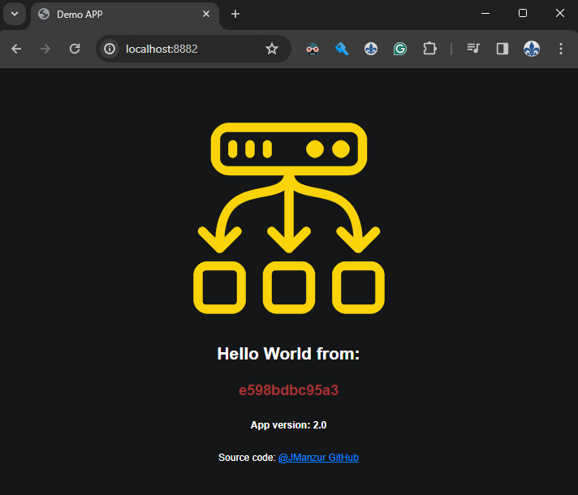

# Load Balancing Demo APP

Why do all demo apps have to be ugly? I don’t want another white page with off-center black text. Let’s use something prettier!

This is a simple Flask app that runs in a Docker container, designed to help test load balancing. The key feature for testing load balancing is that the app returns the hostname of the container it’s running on, so you can verify that your setup is distributing traffic correctly.

The app also includes a status page for health checks and displays the application version in the footer, which is useful for testing rolling updates. Additionally, it has a SIGTERM handler to gracefully shut down the container when it receives a termination signal; perfect for demonstrating how to properly shut down a container in production scenarios.

> #### :bulb: [Also available on Docker Hub!](https://hub.docker.com/r/jmanzur/demo-lb-app)


## Tested with: 

| Environment | Application | Version  |
| ----------------- |-----------|---------|
| WSL2 Ubuntu 20.04 | Docker | 25.0.3  |
| WSL2 Ubuntu 20.04 | Python | 3.10.12 |

## Pulling and Running the app from my Docker Hub:

```bash
docker run --restart=always -d -p 8882:8882 --env APP_VERSION=v2.0 --name DEMO-LB-APP jmanzur/demo-lb-app:latest
```

## Running the app locally (No Docker):

Clone the project

```bash
git clone https://github.com/JManzur/load-balancing-demo-app.git
```

Go to the project directory:
```bash
cd load-balancing-demo-app
```

Proceed to create a virtual environment:
```bash
python3 -m venv venv
```

```bash
source venv/bin/activate
```

```bash
venv/bin/pip3 install -r requirements.txt 
```

Start the server:
```bash
python3 app.py
```

Access the web app:

[http://127.0.0.1:8882/](http://127.0.0.1:8882/)

And you will see something like this:



## Test the healthcheck status page

In order to test the healthcheck status page, you can access [http://127.0.0.1:8882/status](http://127.0.0.1:8882/status) in a browser or perform a curl like this:

```bash
curl -s http://127.0.0.1:8882/status
```

:bulb: **TIP**: Use "python3 -m json.tool" to prettify the json output

```bash
curl -s http://127.0.0.1:8882/status | python3 -m json.tool
```

:bulb: **TIP**: [jq](https://jqlang.github.io/jq/download/) also works great for this:

```bash
curl -s http://127.0.0.1:8882/status | jq -r
```


## Build and Run the Docker image Locally:

Form the project directory run:
```bash
docker build -t demo-lb-app .
```

After building the image if you wish to test it locally run the following command.

Copy the IMAGE_ID
```bash
docker image ls
```

Run the image
```bash
docker run --restart=always -d -p 8882:8882 --env APP_VERSION=v2.0 --name DEMO-LB-APP <IMAGE_ID>
```

:bulb: **TIP**: You can also use the `rebuild_image.sh` script located in the scripts directory to build and run the image.

## Run the Docker image in a EKS Kubernetes Cluster

Go to the [kubernetes directory](./kubernetes) and apply the manifests:

```bash
kubectl apply -f .
```

For more information and tips on how to deploy this app in a EKS Kubernetes Cluster, check the [README file](./kubernetes/README.md) in the [kubernetes directory](./kubernetes).

### Aditional tips:

### Use a `while` loop to test the load balancing:

```bash
while true; do echo -n; curl -s http://<alb-dns>/status | jq -r; sleep 1; done
```

### Test Load Balancers stickiness:

To test sticky sessions with an AWS ALB Ingress Controller, make sure you have the following annotation in your `ingress.yaml` file:

```yaml
alb.ingress.kubernetes.io/target-group-attributes: stickiness.enabled=true,stickiness.lb_cookie.duration_seconds=60
```

Then, capture the cookie using `curl -c` option and use it in subsequent requests with `curl -b` option.
```bash
# Get the cookie
curl -c cookies.txt http://<alb-dns>
for i in {1..100}; do curl -b cookies.txt http://<alb-dns>/sticky; done
```

Alternatively, you can use the provided `sticky_test.sh` script to automate this process. Make sure to replace `<alb-dns>` with your actual ALB DNS name.
```bash
chmod +x sticky_test.sh
./sticky_test.sh <alb-dns> [duration_in_seconds]
# Example: ./sticky_test.sh demo-lb-app-0000000000.us-east-1.elb.amazonaws.com 60
```

You should see the same hostname in the response if sticky sessions are working. If stickiness is disabled or the session breaks, you'll hit different backends (with different hostnames).

### Use the `/stress` endpoint to demostrate autoscaling (CPU Load Simulation)

In the deployment.yaml set the `ENABLE_STRESS` value to `"true"`

```bash
while true; do echo -n; curl -s http://<alb-dns>/stress | jq -r; sleep 1; done
```

## Author

- [@JManzur](https://jmanzur.com)

## Documentation

- [Python - Docker Official Images](https://hub.docker.com/_/python)