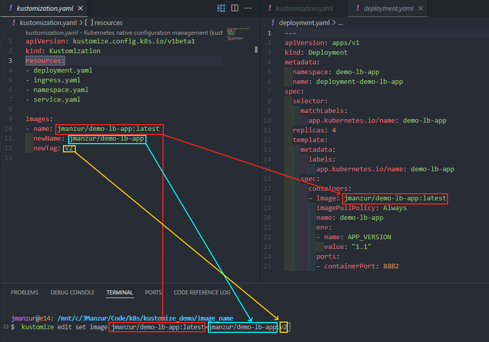

# Running the application in Kubernetes:

To deploy the application is strucutred to be deployed using Kustomize. Kustomize is a tool to customize Kubernetes configurations. It allows you to create a set of patches to apply to a base configuration. 

## Basic Deployment:

Without any changes, and without using Kustomize, you can deploy the application using the following command:

```bash
kubectl apply -f .
```

## Using Kustomize:

Kustomize can be used to do more complex deployments, like changing the image tag, or the number of replicas, the environment variables, etc.

### Change image tag:

Edit the `kustomization.yaml` file and change the image `newTag` value from `latest` to `v2`, or use the following command:

```bash
kustomize edit set image jmanzur/demo-lb-app:latest=jmanzur/demo-lb-app:v2
```

Command explanation:

- `kustomize edit set image`: Command to change the image tag.
- `jmanzur/demo-lb-app:latest`: Current image tag.
- `jmanzur/demo-lb-app:v2`: New image tag.



### Change number of replicas:

Edit the `kustomization.yaml` file and change the number of replicas `count` value to the desired number, or use the following command:

```bash
kustomize edit set replicas deployment-demo-lb-app=4 
```

### Testing, Applying and Deleting the changes:

Test the changes:
```bash
kustomize build .
```

Apply the changes:
```bash
kustomize build . | kubectl apply -f -
```

Delete the changes:
```bash
kustomize build . | kubectl delete -f -
```

⚠️ NOTE: This deployment uses a LoadBalancer service type, so it will create a PUBLIC AWS ELB and you will be charged for it, also your eks cluster needs to have the correct permissions to create the ELB, and the ELB controller needs to be installed in your cluster.

### Documentation:

- [Kustomize](https://kustomize.io/)
- [Install Kustomize](https://kubectl.docs.kubernetes.io/installation/kustomize/)
- [Kustomize edit set image](https://github.com/kubernetes-sigs/kustomize/blob/master/examples/image.md)
- [Install the AWS Load Balancer Controller add-on using Kubernetes Manifests](https://docs.aws.amazon.com/eks/latest/userguide/lbc-manifest.html)
- [Application load balancing on Amazon EKS](https://docs.aws.amazon.com/eks/latest/userguide/alb-ingress.html)